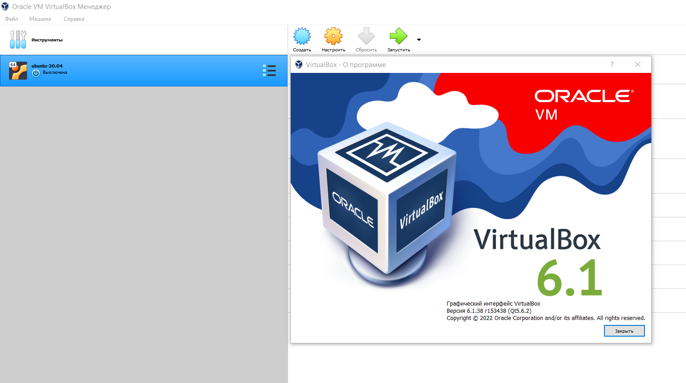
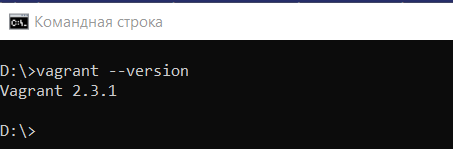
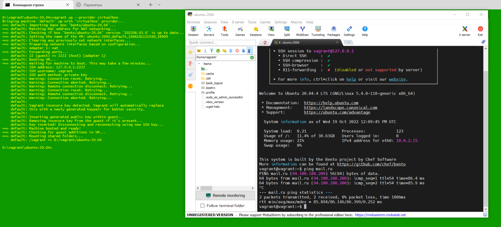
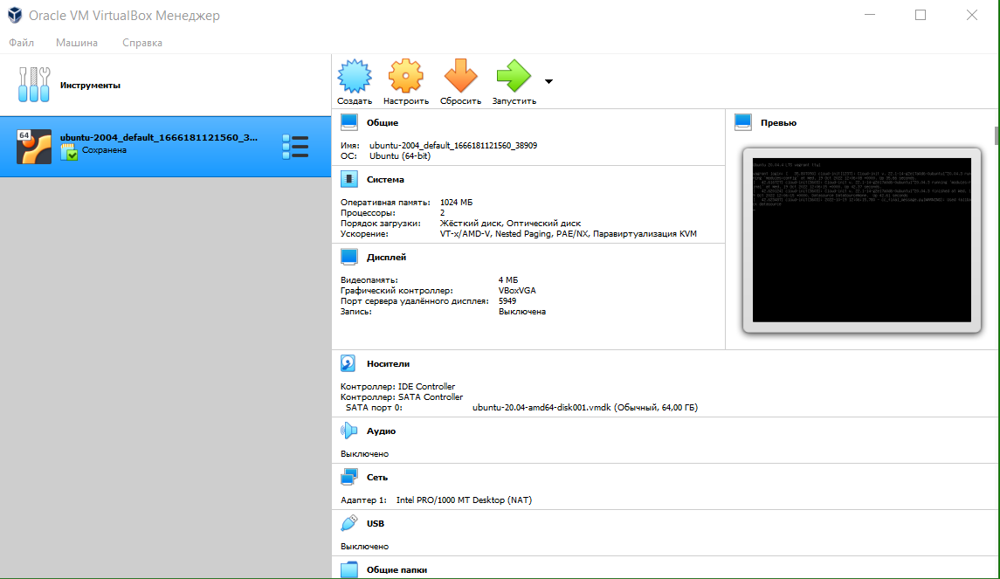
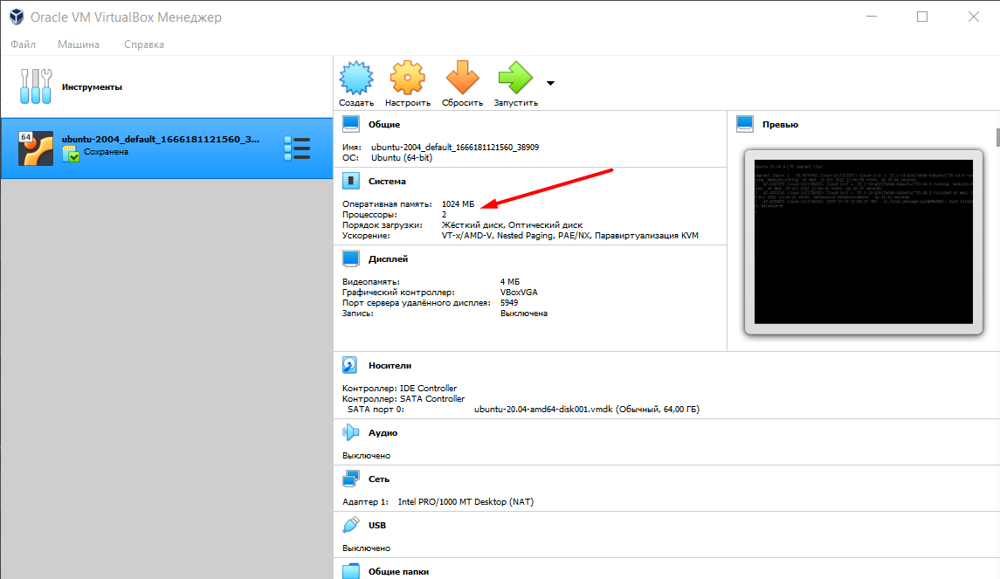
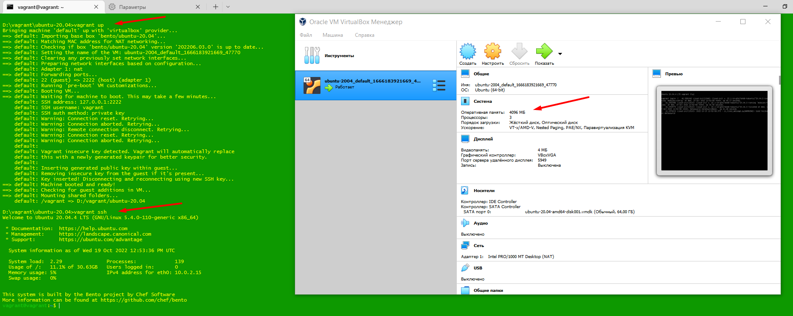
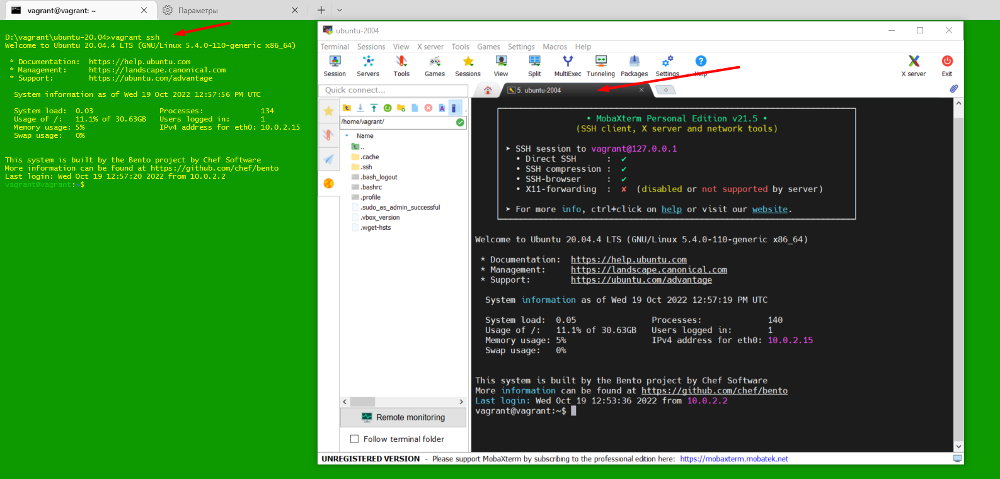
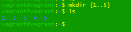

### Домашнее задание к занятию "3.1. Работа в терминале, лекция 1" 
****
###### Окружение: 
###### ОС: Windows 10 Версия 21H2 (сборка ОС 19044.2130)
###### Vagrant 2.3.1
###### VirtualBox 6.1 (ставил версию VirtualBox 7.0, конфликтует с Vagrant 2.3.1)

1. Установите средство виртуализации Oracle VirtualBox.
###### Установил версию https://download.virtualbox.org/virtualbox/6.1.40/VirtualBox-6.1.40-154048-Win.exe

2. Установите средство автоматизации Hashicorp Vagrant.
###### Установил. Проблемы с работой версий VirtualBox 7.0 и Vagrant 2.3.1!!!

3. В вашем основном окружении подготовьте удобный для дальнейшей работы терминал. 
###### Для работы использую MobaXterm

4. С помощью базового файла конфигурации запустите Ubuntu 20.04 в VirtualBox посредством Vagrant:

5. Ознакомьтесь с графическим интерфейсом VirtualBox, посмотрите как выглядит виртуальная машина, которую создал для вас Vagrant,   какие аппаратные ресурсы ей выделены. Какие ресурсы выделены по-умолчанию?

6. Ознакомьтесь с возможностями конфигурации VirtualBox через Vagrantfile: документация. Как добавить оперативной памяти или ресурсов процессора виртуальной машине?
###### Изменил, добавил ОЗУ до 4GB, cpus до 3 ядер (memory = 4096, cpus = 3)

    Vagrant.configure("2") do |config|
 	    config.vm.box = "bento/ubuntu-20.04"
	    config.vm.provider "virtualbox" do |v|
	    v.memory = 4096
        v.cpus = 3
	    end
	
    end

7. Команда vagrant ssh из директории, в которой содержится Vagrantfile, позволит вам оказаться внутри виртуальной машины  без каких-либо дополнительных настроек. Попрактикуйтесь в выполнении обсуждаемых команд в терминале Ubuntu.

8. Ознакомиться с разделами man bash, почитать о настройках самого bash:
 - какой переменной можно задать длину журнала history, и на какой строчке manual это описывается? 
HISTFILESIZE - максимальное число строк в файле истории для сохранения. HISTSIZE - число команд для сохранения. строка 568-574

 - что делает директива ignoreboth в bash? 
ignoreboth это сокращение для 2х директив ignorespace and ignoredups, 
    ignorespace - не сохранять команды начинающиеся с пробела, 
    ignoredups - не сохранять команду, если такая уже имеется в истории
 - 
9. В каких сценариях использования применимы скобки {} и на какой строчке man bash это описано?
###### строчка 151; Для групповых операций и в циклах. Пример:

10. Основываясь на предыдущем вопросе, как создать однократным вызовом touch 100000 файлов? А получилось ли создать 300000?

- touch {000001..100000}.txt - создаст в текущей директории соответсвющее число фалов
- touch {000001..300000}.txt - -bash: /usr/bin/touch: Argument list too long 

11. В man bash поищите по /\[\[. Что делает конструкция [[ -d /tmp ]]

- проверяет условие у -d /tmp и возвращает ее статус (0 или 1), наличие директории /tmp. В случаи успеха вернет "0" т.е по скрипту "каталог есть"

Например в скрипте можно так: 

    if [[ -d /tmp ]]
     then
      echo "каталог есть"
    else
      echo "каталога нет"
    fi
12. Основываясь на знаниях о просмотре текущих (например, PATH) и установке новых переменных; командах, которые мы рассматривали, добейтесь в  выводе type -a bash в виртуальной машине наличия первым пунктом в списке:

    bash is /tmp/new_path_directory/bash 
    bash is /usr/local/bin/bash 
    bash is /bin/bash 

    $ ln -s /usr/bin /tmp/new_path_directory  
    $ PATH=/tmp/new_path_directory:${PATH}  
    $ type -a bash  
    bash is /tmp/new_path_directory/bash  
    bash is /usr/bin/bash  
    bash is /bin/bash  

13. Чем отличается планирование команд с помощью batch и at?

###### at выполняется строго по расписанию

###### batch выполняется, когда позволит нагрузка на систему (load average упадёт ниже 1.5 или значения, заданного командой atd)

14. Завершите работу виртуальной машины чтобы не расходовать ресурсы компьютера и/или батарею ноутбука.
###### vagrant suspend

