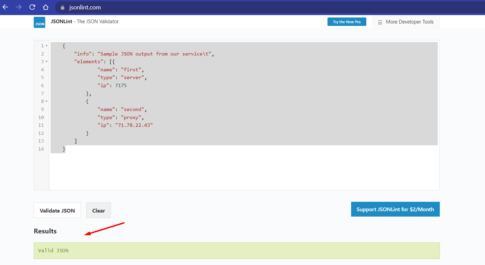

### Домашнее задание к занятию "4.3. Языки разметки JSON и YAML"

1. Мы выгрузили JSON, который получили через API запрос к нашему сервису:
    
       { "info" : "Sample JSON output from our service\t",
        "elements" :[
            { "name" : "first",
            "type" : "server",
            "ip" : 7175 
            }
            { "name" : "second",
            "type" : "proxy",
            "ip : 71.78.22.43
            }
        ]
       }

Нужно найти и исправить все ошибки, которые допускает наш сервис

        {
    	 "info": "Sample JSON output from our service\t",
    	 "elements": [{
    			"name": "first",
    			"type": "server",
    			"ip": 7175
    		},
    		{
    			"name": "second",
    			"type": "proxy",
    			"ip": "71.78.22.43"
    		}
    	 ]
        }

2. В прошлый рабочий день мы создавали скрипт, позволяющий опрашивать веб-сервисы и получать их IP. К уже реализованному функционалу нам нужно добавить возможность записи JSON и YAML файлов, описывающих наши сервисы. Формат записи JSON по одному сервису: { "имя сервиса" : "его IP"}. Формат записи YAML по одному сервису: - имя сервиса: его IP. Если в момент исполнения скрипта меняется IP у сервиса - он должен так же поменяться в yml и json файле.

         #!/usr/bin/env python3

         import os
         import socket
         import time
         import json
         import yaml

         services = ('drive.google.com', 'mail.google.com', 'google.com')
         results = dict()

         JSON_LOG = 'services-online.json'
         YAML_LOG = 'services-online.yaml'

        def save_results_to_logs():
        """
        Saves results to JSON_LOG and YAML_LOG files
        """
        with open(JSON_LOG, 'w') as json_file:
           json.dump(results, json_file, indent=2)
        with open(YAML_LOG, 'w') as yaml_file:
           yaml.dump(results, yaml_file)

        def restore_results_from_logs():
        """
        Restores the previous checks from JSON_LOG or YAML_LOG to results.
        JSON is the preferred format.
        """
        if os.path.exists(JSON_LOG):
            with open(JSON_LOG, 'r') as json_file:
               json.load(json_file)
        elif os.path.exists(YAML_LOG):
               with open(YAML_LOG, 'r') as yaml_file:
                   return yaml.safe_load(yaml_file)
        else:
            return results

        results = restore_results_from_logs()
        while True:
            for fqdn in services:
                ip = socket.gethostbyname(fqdn)
                prev_ip = results.get(fqdn)
                results[fqdn] = ip
                if prev_ip != ip:
                    if prev_ip is not None:
                        print(f"[ERROR] {fqdn} IP mismatch: {prev_ip} {ip}")
                    save_results_to_logs()
            time.sleep(10)

Вывод JSON:

      {
         "drive.google.com": "173.194.222.194",
         "mail.google.com": "64.233.163.83",
         "google.com": "64.233.165.102"
      }

Вывод YAML:
     
    drive.google.com: 173.194.222.194
    google.com: 64.233.165.102
    mail.google.com: 64.233.164.17