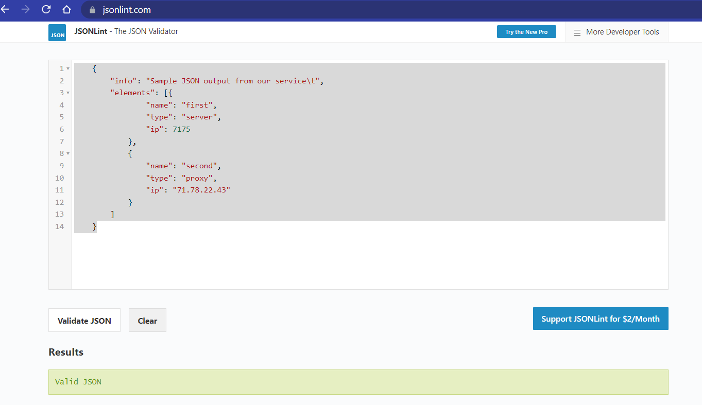
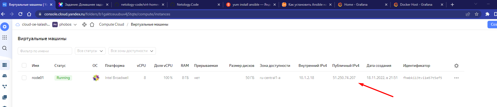
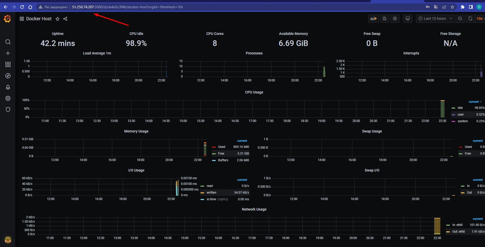

### Домашнее задание "Оркестрация группой Docker контейнеров на примере Docker Compose."

1. Создать собственный образ любой операционной системы (например, centos-7) с помощью Packer (инструкция). Для получения зачета вам необходимо предоставить скриншот страницы с созданным образом из личного кабинета YandexCloud.

2. Создать вашу первую виртуальную машину в YandexCloud. Для получения зачета, вам необходимо предоставить cкриншот страницы свойств созданной ВМ из личного кабинета YandexCloud.

3. Создать ваш первый готовый к боевой эксплуатации компонент мониторинга, состоящий из стека микросервисов. Для получения зачета, вам необходимо предоставить:

