# Домашнее задание к занятию "2. SQL"

## Введение

Перед выполнением задания вы можете ознакомиться с 
[дополнительными материалами](https://github.com/netology-code/virt-homeworks/blob/virt-11/additional/README.md).

## Задача 1

Используя docker поднимите инстанс PostgreSQL (версию 12) c 2 volume, 
в который будут складываться данные БД и бэкапы.

Приведите получившуюся команду или docker-compose манифест.

## Ответ 1

```
version: '3.6'

services:
  postgres:
    container_name: psql
    image: postgres:12
    environment:
      POSTGRES_USER: ${POSTGRES_USER:-test-admin-user}
      POSTGRES_PASSWORD: ${POSTGRES_PASSWORD:-kalina}
      POSTGRES_DB: ${POSTGRES_DB:-test_db}
      PGDATA: /data/postgres
    volumes:
       - postgres:/data/postgres
       - backup:/postgresql/backup
    ports:
      - "5432:5432"
    networks:
      - postgres
    restart: unless-stopped
  
  pgadmin:
    container_name: pgadmin
    image: dpage/pgadmin4
    environment:
      PGADMIN_DEFAULT_EMAIL: ${PGADMIN_DEFAULT_EMAIL:-pgadmin4@pgadmin.org}
      PGADMIN_DEFAULT_PASSWORD: ${PGADMIN_DEFAULT_PASSWORD:-admin}
      PGADMIN_CONFIG_SERVER_MODE: 'False'
    volumes:
       - pgadmin:/var/lib/pgadmin

    ports:
      - "${PGADMIN_PORT:-5050}:80"
    networks:
      - postgres
    restart: unless-stopped

networks:
  postgres:
    driver: bridge

volumes:
    postgres:
    backup:
    pgadmin:
```
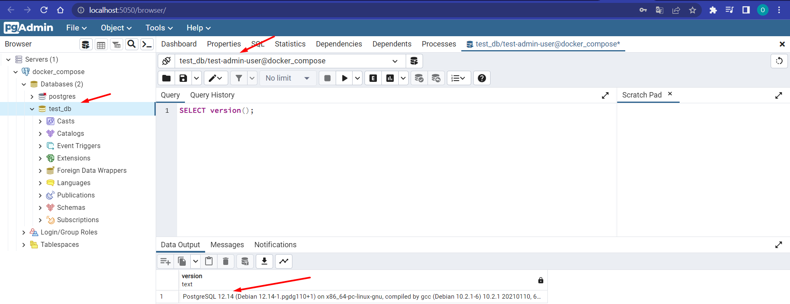</br>
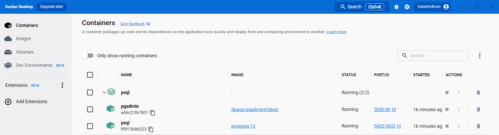</br>
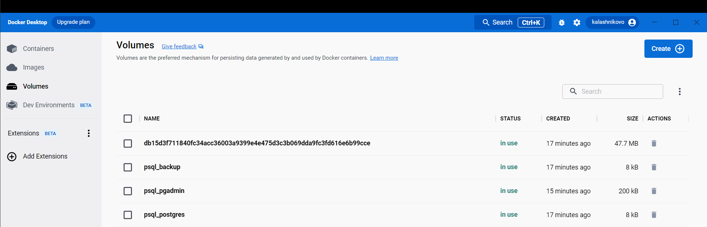</br>

## Задача 2

В БД из задачи 1: 
- создайте пользователя test-admin-user и БД test_db
- в БД test_db создайте таблицу orders и clients (спeцификация таблиц ниже)
- предоставьте привилегии на все операции пользователю test-admin-user на таблицы БД test_db
- создайте пользователя test-simple-user  
- предоставьте пользователю test-simple-user права на SELECT/INSERT/UPDATE/DELETE данных таблиц БД test_db

Таблица orders:
- id (serial primary key)
- наименование (string)
- цена (integer)

Таблица clients:
- id (serial primary key)
- фамилия (string)
- страна проживания (string, index)
- заказ (foreign key orders)

Приведите:
- итоговый список БД после выполнения пунктов выше,
- описание таблиц (describe)
- SQL-запрос для выдачи списка пользователей с правами над таблицами test_db
- список пользователей с правами над таблицами test_db

## Ответ 2

- Пользователя test-admin-user и БД test_db были созданы из файла ***docker-compose.yml***.
- Создание таблиц "orders" и "clients"

```
CREATE TABLE orders (id SERIAL PRIMARY KEY, name VARCHAR, price INT);

CREATE TABLE clients (id SERIAL PRIMARY KEY, 
					  fullname VARCHAR, 
					  country VARCHAR, 
					  order_id SERIAL NOT NULL, 
					  FOREIGN KEY (order_id) REFERENCES orders (id));
		  
```
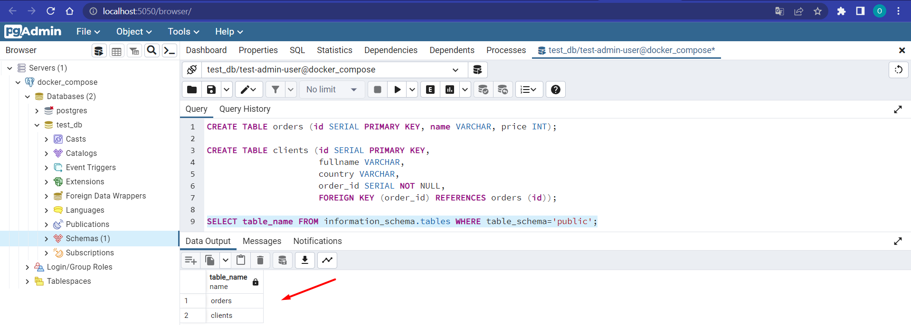</br>

- предоставьте привилегии на все операции пользователю test-admin-user на таблицы БД test_db
```
GRANT ALL ON orders, clients TO "test-admin-user";
```
- создайте пользователя test-simple-user  
```
CREATE USER "test-simple-user";
```
- предоставьте пользователю test-simple-user права на SELECT/INSERT/UPDATE/DELETE данных таблиц БД test_db
```
GRANT SELECT,INSERT,UPDATE,DELETE ON orders, clients to "test-simple-user";
```
- итоговый список БД после выполнения пунктов выше,
```
SELECT table_name FROM information_schema.tables
WHERE table_schema NOT IN ('information_schema','pg_catalog');
```
- описание таблиц (describe)
```
\d+ orders
\d+ clients
```
- SQL-запрос для выдачи списка пользователей с правами над таблицами test_db
```
SELECT table_name,grantee,privilege_type 
FROM information_schema.table_privileges
WHERE table_schema NOT IN ('information_schema','pg_catalog');
```
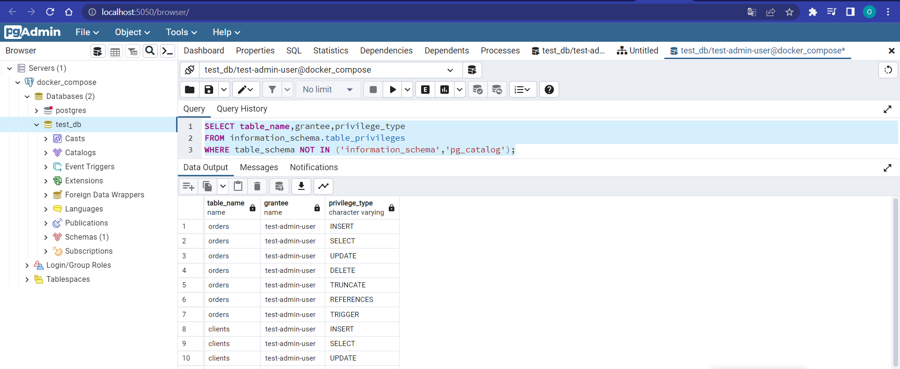</br>

## Задача 3

Используя SQL синтаксис - наполните таблицы следующими тестовыми данными:

Таблица orders

|Наименование|цена|
|------------|----|
|Шоколад| 10 |
|Принтер| 3000 |
|Книга| 500 |
|Монитор| 7000|
|Гитара| 4000|

Таблица clients

|ФИО|Страна проживания|
|------------|----|
|Иванов Иван Иванович| USA |
|Петров Петр Петрович| Canada |
|Иоганн Себастьян Бах| Japan |
|Ронни Джеймс Дио| Russia|
|Ritchie Blackmore| Russia|

Используя SQL синтаксис:
- вычислите количество записей для каждой таблицы 
- приведите в ответе:
    - запросы 
    - результаты их выполнения.

## Ответ 3

```
INSERT INTO orders (name,price) VALUES
('Шоколад',10),
('Принтер',3000),
('Книга',500),
('Монитор',7000),
('Гитара',4000);
SELECT * FROM orders;

ALTER TABLE clients ALTER COLUMN order_id DROP NOT NULL;

INSERT INTO clients (fullname,country,order_id) VALUES
('Иванов Иван Иванович','USA',NULL),
('Петров Петр Петрович','Canada',NULL),
('Иоганн Себастьян Бах','Japan',NULL),
('Ронни Джеймс Дио','Russia',NULL),
('Ritchie Blackmore','Russia',NULL);

SELECT * FROM clients; 
SELECT * FROM orders; 

SELECT count(*) FROM clients;
SELECT count(*) FROM orders;

```
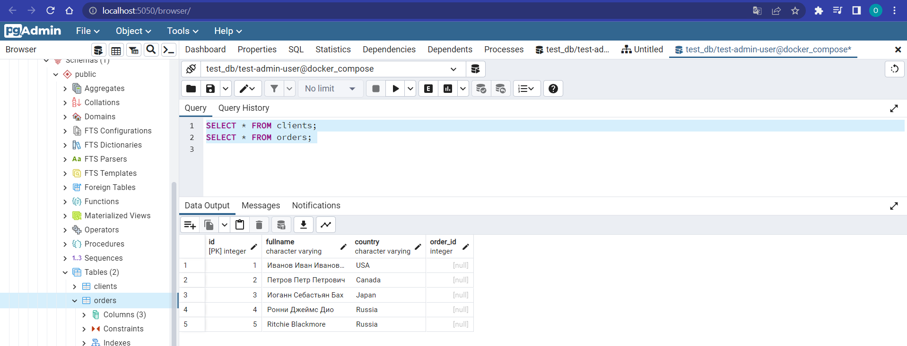</br></br>
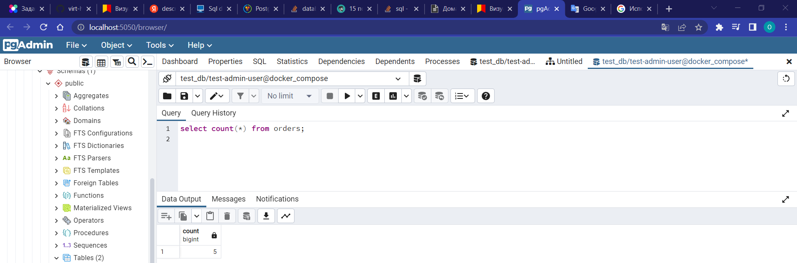</br></br>
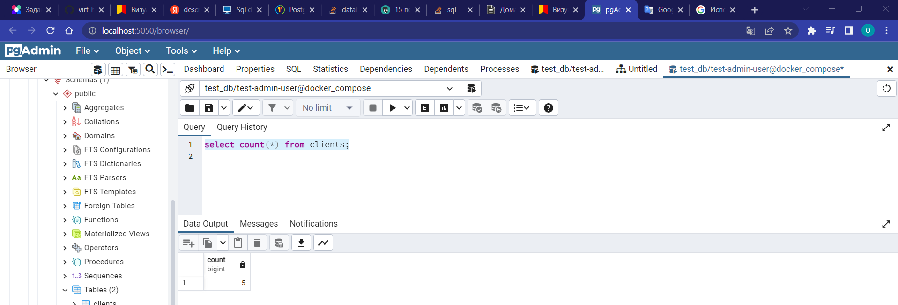</br>


## Задача 4

Часть пользователей из таблицы clients решили оформить заказы из таблицы orders.

Используя foreign keys свяжите записи из таблиц, согласно таблице:

|ФИО|Заказ|
|------------|----|
|Иванов Иван Иванович| Книга |
|Петров Петр Петрович| Монитор |
|Иоганн Себастьян Бах| Гитара |

Приведите SQL-запросы для выполнения данных операций.

Приведите SQL-запрос для выдачи всех пользователей, которые совершили заказ, а также вывод данного запроса.

Подсказк - используйте директиву `UPDATE`.

## Ответ 4

```
UPDATE clients
SET order_id = (SELECT id FROM orders WHERE name = 'Книга')
WHERE fullname = 'Иванов Иван Иванович';

UPDATE clients
SET order_id = (SELECT id FROM orders WHERE name = 'Монитор')
WHERE fullname = 'Петров Петр Петрович';

UPDATE clients
SET order_id = (SELECT id FROM orders WHERE name = 'Гитара')
WHERE fullname = 'Иоганн Себастьян Бах';

```
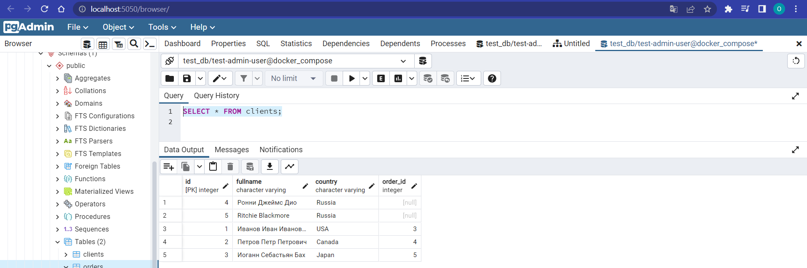</br></br>
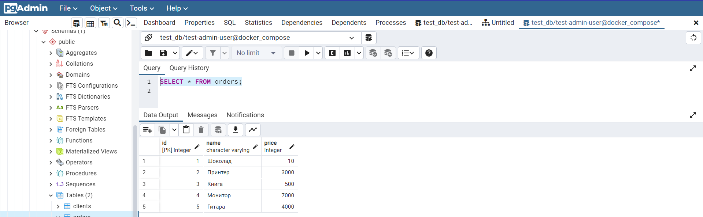</br>

## Задача 5

Получите полную информацию по выполнению запроса выдачи всех пользователей из задачи 4 
(используя директиву EXPLAIN).
Приведите получившийся результат и объясните что значат полученные значения.

## Ответ 5

```
EXPLAIN SELECT * FROM clients;
analyze clients;

```
**Seq Scan** — означает, что используется последовательное, блок за блоком, чтение данных таблицы clients
**Cost** - некая виртуальная величина призванная оценить затратность операции. Первое значение 0.00 — затраты на получение первой строки. Второе — 18.10 — затраты на получение всех строк.
Единица измерения cost – «извлечение одной страницы в последовательном (sequential) порядке». То есть оценивается и время, и использование ресурсов.

**rows** — приблизительное количество возвращаемых строк при выполнении операции Seq Scan. Это значение возвращает планировщик.

**width** - это оценка PostgreSQL того, сколько, в среднем, байт содержится в одной строке, возвращенной в рамках данной операции

Как я понял, вывод этой информации - ожидания планировщика.
А если дать команду analyze и повторить запрос, то количество строк будет более реалистичным, и cost поменяется - потому что БД проведёт анализ.
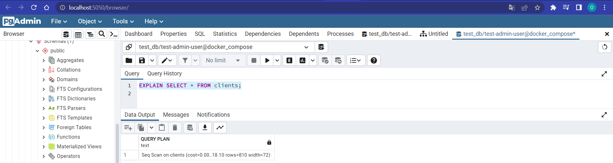</br></br>
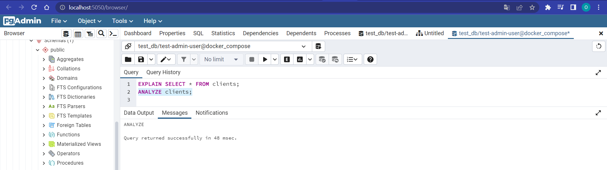</br>


## Задача 6

Создайте бэкап БД test_db и поместите его в volume, предназначенный для бэкапов (см. Задачу 1).

Остановите контейнер с PostgreSQL (но не удаляйте volumes).

Поднимите новый пустой контейнер с PostgreSQL.

Восстановите БД test_db в новом контейнере.

Приведите список операций, который вы применяли для бэкапа данных и восстановления. 

---

## Ответ 6
- Подключаемся к контейнеру "psql". docker exec -it psql bash
- Запускаем бэкап
```
pg_dump -U postgres test_db > /postgresql/backup/test_db.sql

```
- Создал новую директорию для нового docker-compose, в которой создал директорию pg_data и скопировал pg_backup из первого стека контейнеров.
- Изменил docker-compose.yml с новыми сетевыми настройками и именем контейнера:
```
version: '3.6'

services:
  postgres:
    container_name: psql1
    image: postgres:12
    environment:
      POSTGRES_USER: ${POSTGRES_USER:-test-admin-user}
      POSTGRES_PASSWORD: ${POSTGRES_PASSWORD:-kalina}
      POSTGRES_DB: ${POSTGRES_DB:-test_db}
      PGDATA: /data/postgres
    volumes:
       - postgres:/data/postgres
       - backup:/postgresql/backup
    ports:
      - "5432:5432"
    networks:
      - postgres
    restart: unless-stopped

networks:
  postgres:
    driver: bridge

volumes:
    postgres:
    backup:
```
- Запустил новый стек командой: docker-compose up -d.
- Подключился в новый контейнер командой: docker exec -it bash
- Создал пользователей: test-admin-user и test-simple-user
- Восстановил базу командой:
```
psql -h localhost -U posgtres test_db < /postgresql/backup/test_db.sql
```
### Как cдавать задание

Выполненное домашнее задание пришлите ссылкой на .md-файл в вашем репозитории.

---
